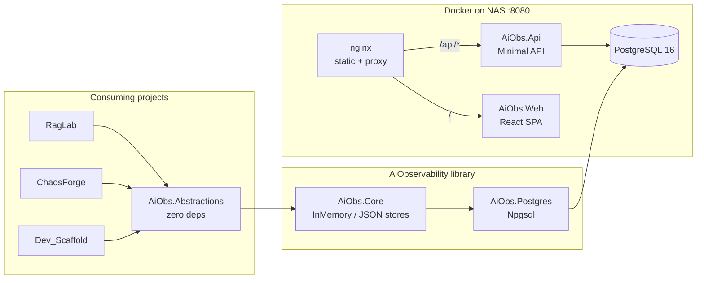

# AiObservability

A lightweight .NET 10 observability library for AI pipelines. Every LLM call, retrieval step, and agent action becomes a **span** inside a **trace**, persisted to PostgreSQL and browsable via a built-in web UI.

Designed to instrument [RagLab](../RagLab), [ChaosForge](../ChaosForge), and [Dev_Scaffold](../Dev_Scaffold) without coupling any of them to a specific storage backend.

---

## Why This Exists

OpenTelemetry and vendor-specific SDKs (LangSmith, Weights & Biases) are either too heavy or too coupled to specific models and frameworks. This project provides a minimal, dependency-free abstraction layer that any .NET project can reference, with a denormalized PostgreSQL backend that is directly inspectable with standard SQL tooling — no proprietary dashboard required.

---

## Architecture Overview



**Dependency rule:** consuming projects reference `AiObs.Abstractions` in domain/core layers and `AiObs.Postgres` only at the composition root (Program.cs / CLI entrypoint).

---

## Key Design Decisions

- **Denormalized schema — full span tree as JSONB** (`root_spans` column). The primary access pattern is retrieve-one-trace-by-ID; a single `SELECT` with no joins or recursive CTEs covers it. Span-level aggregate analytics are explicitly out of scope for the initial version. → [ADR-004](docs/adr/ADR-004-denormalized-schema.md)

- **`JsonNode?` for `Input` and `Output`, not `object?`**. Serialization happens eagerly at `WithInput()` / `WithOutput()` call time, so errors surface at the instrumentation site rather than at persistence time. JSONB columns in PostgreSQL render the result as human-readable structured JSON without extra tooling. → [ADR-005](docs/adr/ADR-005-jsonnode-input-output.md)

- **Strict child span validation** — `Complete()` throws `InvalidOperationException` if any child span is still open. Silently auto-closing children would produce traces with incorrect latency data: a worse outcome than a development-time exception. `Dispose()` force-closes with `SpanStatus.Error` to remain compliant with the .NET contract. → [ADR-006](docs/adr/ADR-006-strict-child-span-validation.md)

- **`AiObs.Postgres` in a separate project**. `AiObs.Core` carries zero external NuGet dependencies. Npgsql is isolated to the Postgres project so test and local-dev scenarios never pull in a database driver. → [ADR-007](docs/adr/ADR-007-postgres-separate-project.md)

- **Npgsql direct, no EF Core**. The data access surface is three SQL statements (INSERT, SELECT by ID, filtered SELECT). EF Core's change tracking has no value for immutable records and would introduce a heavyweight dependency into a library that consuming projects may also use. → [ADR-003](docs/adr/ADR-003-npgsql-direct.md)

- **nginx as the single public entry point**. The React SPA uses relative URLs (`/api/traces`) — no IP address is baked into the build. nginx proxies `/api/*` to the API container on the internal Docker network. The API container is never exposed on the host network. → [ADR-009](docs/adr/ADR-009-nginx-reverse-proxy.md)

---

## Tech Stack

| Layer | Technology |
|---|---|
| Library | .NET 10, C# |
| Storage | PostgreSQL 16 Alpine (JSONB) |
| Data access | Npgsql 9 (direct SQL, no ORM) |
| API | ASP.NET Core Minimal API |
| Frontend | React 18, Vite |
| Serving / proxy | nginx:alpine |
| Containers | Docker Compose |

---

## Project Status

**MVP — complete.**

Done:
- `AiObs.Abstractions`, `AiObs.Core`, `AiObs.Postgres` library projects
- `InMemoryTraceStore` (tests), `JsonTraceStore` (local dev), `PostgresTraceStore` (production)
- `AiObs.Api` — `GET /traces`, `GET /traces/{id}`, `DELETE /traces/{id}`, export endpoints
- `AiObs.Web` — trace list with filter bar, trace detail with span tree
- Docker Compose stack (postgres + api + nginx/web)
- Unit tests for builders and store contracts

Next:
- Integration with RagLab, ChaosForge, Dev_Scaffold consuming projects

---

## Getting Started

```bash
# Start PostgreSQL, API, and Web UI
cd docker && docker compose up -d

# Open trace viewer
open http://localhost:8080
```

Schema is created automatically on API startup (`SchemaInitializer.EnsureCreatedAsync()`).

**Library integration (consuming project):**

```csharp
// Composition root (Program.cs)
builder.Services.AddPostgresTraceStore("Host=nas.local;Database=aiobs;Username=aiobs;Password=...");

// Infrastructure layer — inject ITraceStore, reference only AiObs.Abstractions
public class QueryPipeline(ITraceStore traceStore, ...)
{
    public async Task<string> QueryAsync(string question, CancellationToken ct)
    {
        await using var trace = traceStore.StartTrace("rag_query");
        trace.WithTag("pipeline", "RagLab").WithTag("model", "claude-sonnet-4-6");

        using var embedSpan = trace.StartSpan("embed_query");
        var embedding = await _embedder.EmbedAsync(question, ct);
        embedSpan.WithInput(question).WithOutput(embedding).Complete();

        using var genSpan = trace.StartSpan("generate");
        var answer = await _generator.GenerateAsync(question, ct);
        genSpan.WithOutput(answer.Text)
               .WithMetadata("input_tokens", answer.InputTokens)
               .WithMetadata("output_tokens", answer.OutputTokens)
               .Complete();

        await trace.CompleteAsync(ct);
        return answer.Text;
    }
}
```

**Storage backends:**

| Class | Project | Use case |
|---|---|---|
| `InMemoryTraceStore` | `AiObs.Core` | Unit tests |
| `JsonTraceStore` | `AiObs.Core` | Local dev without Docker |
| `PostgresTraceStore` | `AiObs.Postgres` | Production / NAS |

---

## Related Projects

- **RagLab** — RAG pipeline with local LLM inference; primary consumer of this library
- **ChaosForge** — Multi-agent task orchestration
- **Dev_Scaffold** — Code scaffolding CLI
